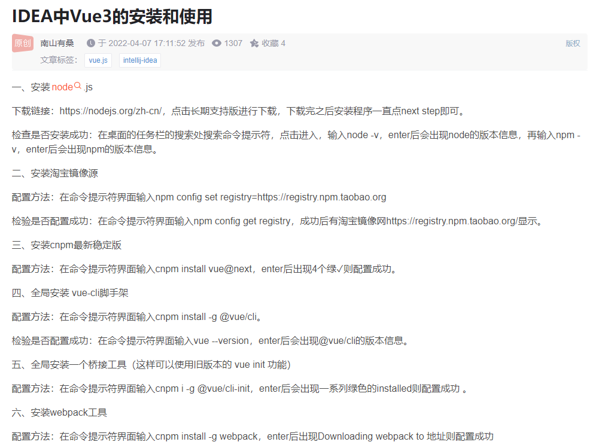
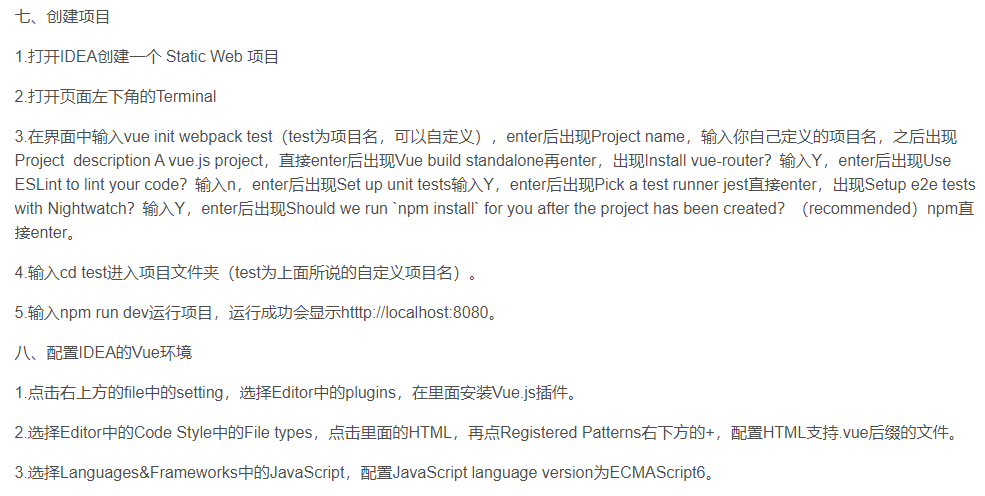
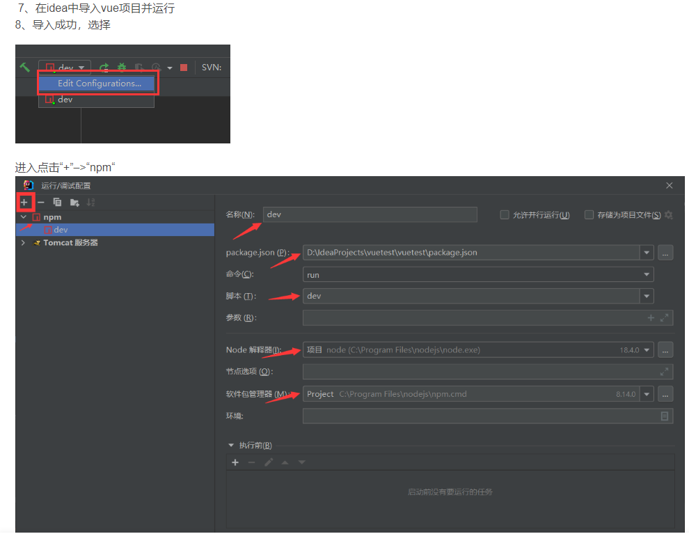

# vue1

> A Vue.js project

## Build Setup

``` bash
# install dependencies
npm install

# serve with hot reload at localhost:8080
npm run dev

# build for production with minification
npm run build

# build for production and view the bundle analyzer report
npm run build --report

# run unit tests
npm run unit

# run e2e tests
npm run e2e

# run all tests
npm test
```

For a detailed explanation on how things work, check out the [guide](http://vuejs-templates.github.io/webpack/) and [docs for vue-loader](http://vuejs.github.io/vue-loader).


IDEA中Vue3的安装和创建项目

https://blog.csdn.net/weixin_50522741/article/details/124018092

遇到问题：
'cnpm' 不是内部或外部命令,真正有效解决方法  https://blog.csdn.net/u011095110/article/details/85296607

创建项目：


【IntelliJ IDEA】idea支持vue文件，设置对vue的支持
https://blog.csdn.net/weixin_44299027/article/details/115891443?spm=1001.2101.3001.6650.3&utm_medium=distribute.pc_relevant.none-task-blog-2%7Edefault%7EBlogCommendFromBaidu%7ERate-3-115891443-blog-117462702.topnsimilarv1&depth_1-utm_source=distribute.pc_relevant.none-task-blog-2%7Edefault%7EBlogCommendFromBaidu%7ERate-3-115891443-blog-117462702.topnsimilarv1&utm_relevant_index=6

运行与配置

