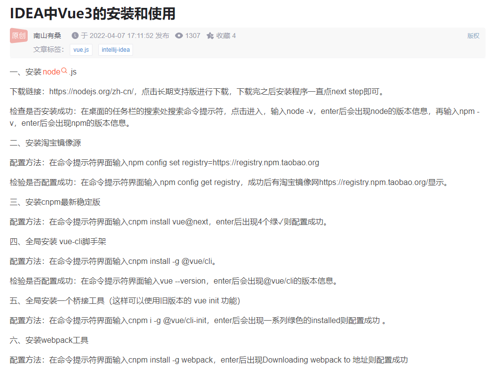
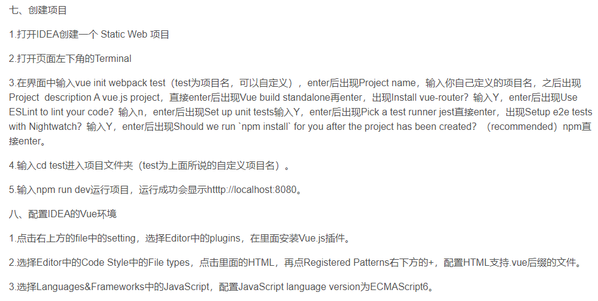
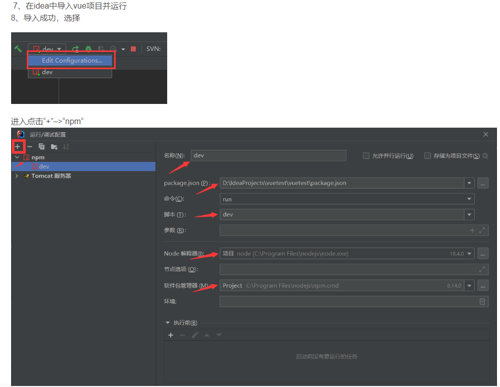

IDEA中Vue3的安装和创建项目

https://blog.csdn.net/weixin_50522741/article/details/124018092

遇到问题：
'cnpm' 不是内部或外部命令,真正有效解决方法  https://blog.csdn.net/u011095110/article/details/85296607

创建项目：

【IntelliJ IDEA】idea支持vue文件，设置对vue的支持
https://blog.csdn.net/weixin_44299027/article/details/115891443?spm=1001.2101.3001.6650.3&utm_medium=distribute.pc_relevant.none-task-blog-2%7Edefault%7EBlogCommendFromBaidu%7ERate-3-115891443-blog-117462702.topnsimilarv1&depth_1-utm_source=distribute.pc_relevant.none-task-blog-2%7Edefault%7EBlogCommendFromBaidu%7ERate-3-115891443-blog-117462702.topnsimilarv1&utm_relevant_index=6

运行与配置

